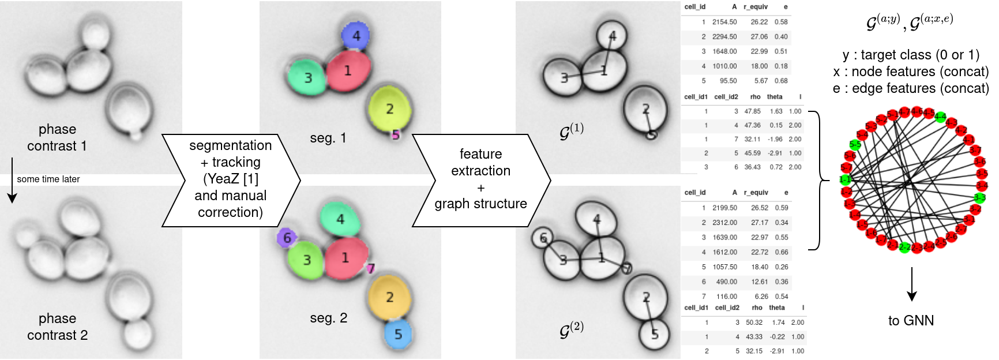
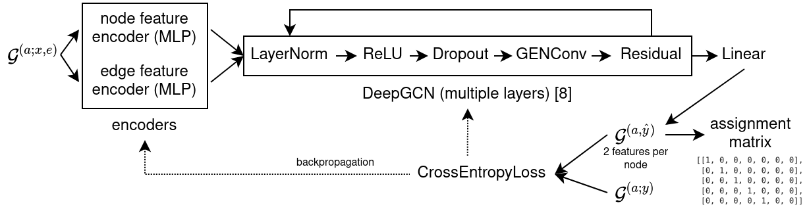

# `bread`, a graph neural network for tracking yeast cells in segmented movies

> Abstract — We present a graph-based machine learning
method that is able to track yeast cells throughout a
movie, after having segmented the frames (here, this is done
with [YeaZ](https://github.com/lpbsscientist/YeaZ-GUI)). The method achieves better accuracy than
the Hungarian algorithm implemented in YeaZ, thanks to
the context-awareness of the graph structure. The method
relies on translating the tracking problem to a binary node
classification problem, and should generalize to any tracking
problem where segmentations are available.


_Fig. 1 : Data preprocessing pipeline. A movie of a budding yeast colony is taken (in phase contrast, as is the case here), then YeaZ is used to segment individual frames, and semi-automatically track cells. Manual corrections to segmentation and tracking are applied as required. From the segmentations, geometric features are extracted, as well as features describing the neighborhood of each cell. This is stored in a graph structure 𝒢⁽¹⁾ and 𝒢⁽²⁾, from which an assignment graph 𝒢⁽ᵃ;ˣ,ᵉ⁾ is built. A ground truth assignment graph 𝒢⁽ᵃ;ʸ⁾ is also built. Both assignment graphs are then used by the GNN for training._


_Fig. 2 : The GNN structure. For a given input graph, the node and edge features are encoded by MLPs. The resulting graph is then convolved multiple times following DeepGCN. A final linear layer maps the encoded node features down to two, and CrossEntropyLoss is computed for backpropagation. For evaluation, the node features of the output graph can be reduced and reshaped to build an assignment matrix._


```
.
├── bread  # bread packages utilities for dealing with data, utilities and visualization
│   ├── algo  # contains implementation of the GNN
│   ├── data  # loading and saving data from various formats, and feature extraction
│   ├── utils  # general utilities, such as getting cell ids from a segmentation, cell contours, etc.
│   └── vis  # visualization utilities
├── datamanip
│   └── preprocess.ipynb  # preprocess raw data to store it in more accessible .npz format
├── data  # general purpose data folder, not included in this repository due to space constraints
├── experiment_gnn
│   ├── data  # data folder for storing the graphs, not included in this repository due to space constraints
│   ├── model_logs  # tensorboard model logs, not included in this repository
│   ├── model_weights  # saved model weights
│   ├── build_cellgraphs.ipynb  # generates cell graph data from segmentations
│   ├── build_assgraphs.ipynb  # generates assignment graphs from cell graphs
│   ├── run_train.py  # training script
│   ├── compare_yeaz.ipynb  # compare accuracy of YeaZ and GNN on the test dataset
│   ├── hparams.ipynb  # plot hyperparameters from tensorboard model logs
│   └── pipeline.ipynb  # explains the full pipeline for tracking cells from frame to frame
├── README.md
└── report_gnn
    ├── literature.bib
    ├── Makefile  # run `make report` to regenerate the PDF
    ├── report.pdf
    ├── report.tex
    └── figures
        └── make_figures.ipynb  # generate (most of) the figures used in the report
```

A demonstration of the full pipeline, and how to use the main functions of the `bread` package is available in `experiment_gnn/pipeline.ipynb`.

The research process is as follows :

1. Preprocess the movies obtained from the microscopy labs to store it in convenient `.npz` files. This is done in `datamanip/preproces.ipynb`.
2. Segment the movies (here, done using YeaZ https://github.com/lpbsscientist/YeaZ-GUI), and store the segmentations as `.npz` files.
3. Use the segmentation to extract geometrical features and generate cell graphs. This is done in `experiment_gnn/build_cellgraphs.ipynb`.
4. Use the generated cell graphs to generate assignment graphs. This is done in `experiment_gnn/build_assgraphs.ipynb`.
5. Train the GNN on the assignment graphs (node classification problem), using `experiment_gnn/run_train.py`. Results from these training sessions are found in `experiment_gnn/model_logs`, and can be visualized using Tensorboard (https://www.tensorflow.org/tensorboard/) by running `tensorboard --logdir=experiment_gnn/model_logs`.
6. Assert the performance of the models on a test dataset, and compare with the built-in tracking algorithm of YeaZ. This is done in `experiment_gnn/compare_yeaz.ipynb`.

Download the data at : https://transfer.sh/Y2GJNO/data.tar.gz. (Note : this link is valid until 4 jan 2022)

Note : this repository is slice of a larger unpublished (for now) repository that hosts more algorithms and scripts useful in the context of yeast cell microscopy analysis, hence the (unnecessarily) deep directory structure.
